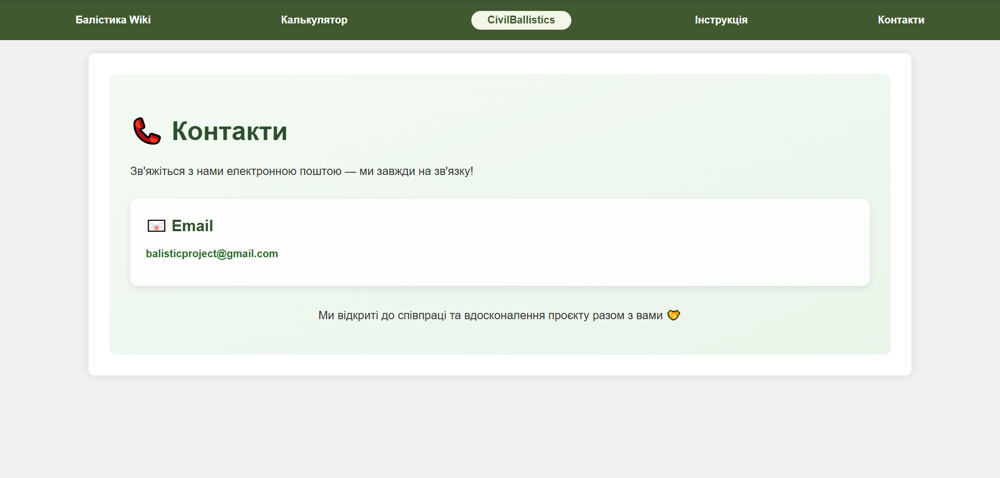

# Civil Ballistics
## Header
Кожна сторінка веб-застосунку має header: по центру розміжена назва "CivilBallistics", що переносить на основну сторінку, ліворуч - основний функціонал (Балістика Wiki, Калькулятор), праворуч - інструкція для використання та контаки.

## Основна сторінка
Опис нашого функціоналу

## Балістика Wiki
Загальний список ракет з набором інформації про них.

При виборі ракети відкривається сторінка з чітким описом ракети, її призначенням, бойовими характеристиками, історією розробки, типами головних частин, бойовим застосуванням, фото та короткою таблицею. 

## Калькулятор

Калькулятор використовується для розрахунку зони ураження від влучання обраної ракети.

Для розрахунку потрібно вибрати одну з ракет, запропонованих в переліку, та поставити точку очікуваного влучання на карті.

Після завершення розрахунків показані зони ураження, значення кожної з яких та наслідки вказані в лівому нижньому кутку. Праворуч розміщена коротка інформація про ракету та фото, деталі розрахунків.

## Інструкція

У меню з інструкцією коротко описана хронологія використання веб-застосунку

## Контакти
У контактах розміщене посилання на електронну скриньку нашого проєкту.

## Технології

- **Frontend**: HTML, CSS, JavaScript
- **Backend**: Python (Flask)
- **База даних**: MongoDB  
- **Хостинг**: Render  
- **Інші інструменти**: Chart.js, Axios, Mongoose, TailwindCSS

